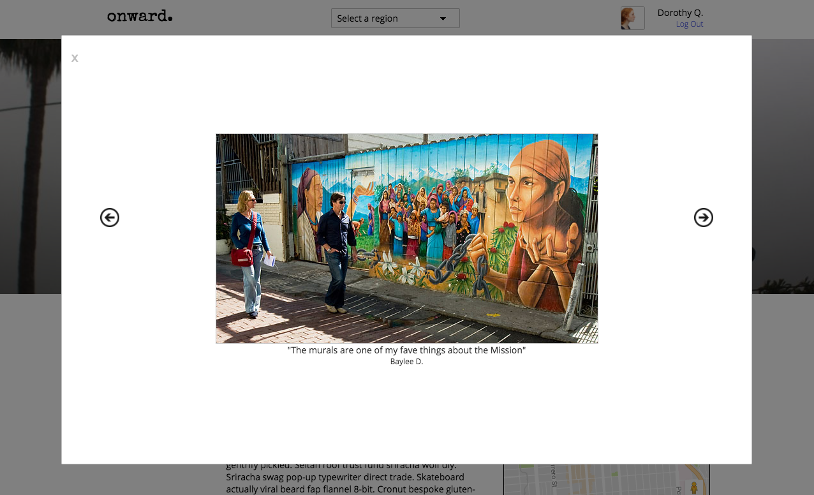

# Onward

[Onward live][heroku]

[heroku]: https://fsp-onward.herokuapp.com/#/

Onward is a full-stack web application inspired by Yelp and Airbnb, targeted at folks
who are relocating to a new city and need help finding a neighborhood to
live in.  The backend is built using Ruby on Rails and a PostgreSQL database, with React.js/Redux on the frontend.  

## Features & Implementation

### Neighborhoods and Neighborhood Pages

Neighborhoods are stored in a separate table in the database, with each neighborhood holding a foreign key to a region (San Francisco, Los Angeles, Chicago, or New York). Each neighborhood has a few key characteristics that help power the neighborhood page and the filter capability:
  + `center_lat` and `center_long` are used to center the map of the neighborhood
  + `walk_score`, `transit_score`, and `cost_of_living` are used as information for searching

#### NeighborhoodImage
The `NeighborhoodImage` component is the main image at the top of the page. The design is largely inspired by Airbnb's listing pages. There is a gradient over the image that gradually makes the image darker to make the "View Photos" button stand out on the right.  Clicking this button, or anywhere else on the image, will bring up a React modal that functions as a slideshow of all the images that have been uploaded by users for the given neighborhood, which highlights each user and any captions they may have included for the photo:



#### NeighborhoodHeader
The `NeighborhoodHeader` houses the two buttons that enable a user to add content to the neighborhood page: Reviews and Images. Both buttons pop up modals over the screen to allow the user to take action.  If the user is not logged in, the modal will display the login form before they are allowed to add content.  Upon login, the modal transitions directly to either the `ReviewForm` component within the same modal or the Cloudinary photo upload widget, depending on the button.  More on reviews in the following section.

####


### Note Rendering and Editing

  On the database side, the notes are stored in one table in the database, which contains columns for `id`, `user_id`, `content`, and `updated_at`.  Upon login, an API call is made to the database which joins the user table and the note table on `user_id` and filters by the current user's `id`.  These notes are held in the `NoteStore` until the user's session is destroyed.  

  Notes are rendered in two different components: the `CondensedNote` components, which show the title and first few words of the note content, and the `ExpandedNote` components, which are editable and show all note text.  The `NoteIndex` renders all of the `CondensedNote`s as subcomponents, as well as one `ExpandedNote` component, which renders based on `NoteStore.selectedNote()`. The UI of the `NoteIndex` is taken directly from Evernote for a professional, clean look:  


Note editing is implemented using the Quill.js library, allowing for a Word-processor-like user experience.

### Notebooks

Implementing Notebooks started with a notebook table in the database.  The `Notebook` table contains two columns: `title` and `id`.  Additionally, a `notebook_id` column was added to the `Note` table.  

The React component structure for notebooks mirrored that of notes: the `NotebookIndex` component renders a list of `CondensedNotebook`s as subcomponents, along with one `ExpandedNotebook`, kept track of by `NotebookStore.selectedNotebook()`.  

`NotebookIndex` render method:

```javascript
render: function () {
  return ({this.state.notebooks.map(function (notebook) {
    return <CondensedNotebook notebook={notebook} />
  }
  <ExpandedNotebook notebook={this.state.selectedNotebook} />)
}
```

### Tags

As with notebooks, tags are stored in the database through a `tag` table and a join table.  The `tag` table contains the columns `id` and `tag_name`.  The `tagged_notes` table is the associated join table, which contains three columns: `id`, `tag_id`, and `note_id`.  

Tags are maintained on the frontend in the `TagStore`.  Because creating, editing, and destroying notes can potentially affect `Tag` objects, the `NoteIndex` and the `NotebookIndex` both listen to the `TagStore`.  It was not necessary to create a `Tag` component, as tags are simply rendered as part of the individual `Note` components.  


## Future Directions for the Project

In addition to the features already implemented, I plan to continue work on this project.  The next steps for FresherNote are outlined below.

### Search

Searching notes is a standard feature of Evernote.  I plan to utilize the Fuse.js library to create a fuzzy search of notes and notebooks.  This search will look go through tags, note titles, notebook titles, and note content.  

### Direct Messaging

Although this is less essential functionality, I also plan to implement messaging between FresherNote users.  To do this, I will use WebRTC so that notifications of messages happens seamlessly.  
